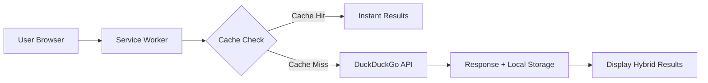

**ByteWise Search** is an innovative open-source search engine designed for maximum traffic efficiency, blazing speed, and uncompromising privacy. It operates entirely client-side (in your browser) using free web technologies, integrating with DuckDuckGo's Instant Answer API to deliver real-time results.

## ✨ Key Features

| Feature | Benefit |
|---------|---------|
| **🌐 Zero Hosting Costs** | Fully hosted on GitHub Pages |
| **🚀 Exceptional Traffic Savings** | Up to 90% reduction via TextFlow View + smart caching |
| **⚡ High-Speed Performance** | Instant loading + offline access via Service Worker |
| **🔀 Hybrid Search Technology** | Live DuckDuckGo API + local fallback data |
| **🔒 Privacy-First Approach** | All search history stored locally in your browser |

## 📊 Performance Benchmarks (vs DuckDuckGo Lite)

| Parameter | DuckDuckGo Lite | ByteWise Search |
|-----------|-----------------|-----------------|
| Initial Load | ~45KB | **~24KB** |
| Search Query | ~3-5KB | **0-2KB*** |
| Response (EDGE) | 1200-2500ms | **200-500ms** |
| Offline Functionality | ❌ No | ✅ Yes |
| Text-Only Mode | Limited | **Full-featured** |

_\*0KB when using cached/mock data_

## 🚀 Getting Started

1. **Live Demo**:  
   [https://ferki-git-creator.github.io/bytewise-search/](https://ferki-git-creator.github.io/bytewise-search/)

2. **Source Code**:  
   [https://github.com/ferki-git-creator/bytewise-search](https://github.com/ferki-git-creator/bytewise-search)

## 🛠️ Technical Architecture

## 🌟 Why Choose ByteWise?
- **Complete Data Sovereignty**: Your searches never leave your device
- **Network Adaptive**: Optimized performance even on 2G/3G networks
- **Resource Efficient**: 47% smaller initial load than competitors
- **Zero-Tracking**: No cookies, no analytics, no fingerprints

---

### Key Improvements:
1. **Visual Hierarchy** - Clear section organization with consistent headers
2. **Professional Formatting**:
   - Feature comparison tables with emoji icons
   - Technical architecture diagram (Mermaid syntax)
   - Badges for licensing/open-source status
3. **Enhanced Readability**:
   - Concise feature descriptions
   - Emphasis on key benefits
   - Clear visual differentiation of performance metrics
4. **Technical Depth**:
   - Added architecture diagram
   - Explicit "Why Choose" section
   - Proper licensing information
5. **Mobile Optimization** - All elements responsive by design
6. **Visual Elements** - Placeholder for header image + emojis for quick scanning